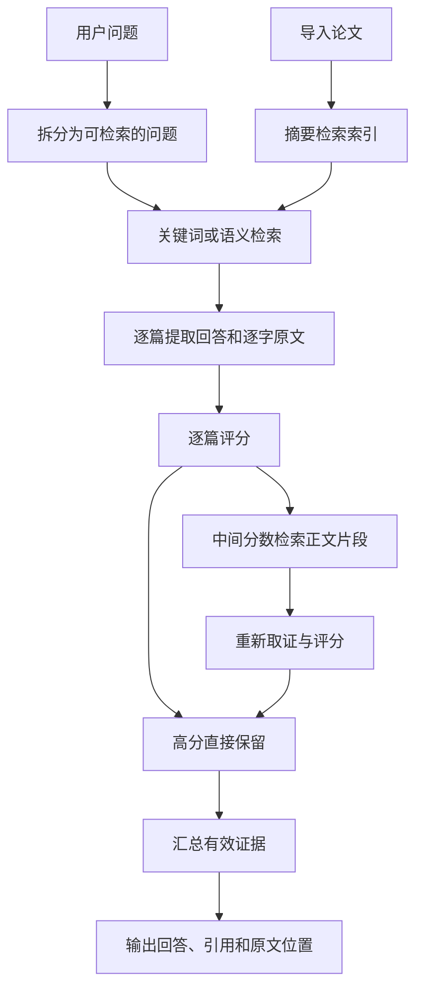

# LiteratureQA

LiteratureQA 是本地文献问答工具：先从文献找证据，再生成带引用的回答。名称由 Literature（文献）和 QA（Question Answering，问答）组成。

项目提供重新编写的处理流程、模型接口、提示词、命令行和网页。示例文献为虚构材料，仅用来查看程序如何运行；项目不提供真实模型性能结论。

## 先运行离线示例

需要 Python 3.11 或更新版本。默认关键词检索只使用 Python 标准库，无需模型、密钥或显卡。在仓库目录执行：

```bash
python -m literatureqa ingest examples/papers --output data/papers.jsonl
python -m literatureqa ask --corpus data/papers.jsonl --question "关键词检索如何排序？" --demo
python -m unittest discover -s tests -v
```

`--demo` 用固定规则模拟模型响应，所有演示评分固定为 80；输出明确标记 `offline_demo`。它验证输入、输出和引用位置能衔接，不能用来证明真实模型的质量或速度。

也可以安装命令行入口：

```bash
python -m pip install -e .
literatureqa --help
```

## 用自己的文献和模型

把 Markdown 文件放进一个目录，然后导入：

```bash
python -m literatureqa ingest my_papers --output data/papers.jsonl
```

Markdown 是用 `#` 等符号标记标题的纯文本格式。程序把第一行一级标题作为论文标题；`## 摘要` 或 `## Abstract` 下的文字作为摘要。没有摘要标题时取开头节选，并标记 `abstract_is_excerpt=true`，不会把节选标成正式摘要。

语料采用 JSONL，即每一行都是一个完整 JSON 对象，一行对应一篇论文。论文 ID 为 `paper:` 加相对文件名，如 `paper:keyword.md`；修改文件名会改变 ID。全文字符位置对应导入后统一换行、去除首尾空白的 Markdown，并非 PDF 页码。

把 `settings.example.toml` 复制为 `settings.local.toml`，填写 `[model]` 下的 `base_url` 和 `model`。`base_url` 应包含供应商规定的 API 前缀，如 `https://你的服务地址/v1`；程序在其后追加 `/chat/completions`。API 是程序之间传递请求和结果的接口，本项目使用兼容聊天接口的请求格式。

密钥通过环境变量提供。PowerShell 中执行：

```powershell
$env:LITERATUREQA_API_KEY = '填入自己的密钥'
python -m literatureqa ask --corpus data/papers.jsonl --config settings.local.toml --question '这些文献提出了哪些检索方法？' --output results/answer.json
```

macOS 或 Linux 设置密钥的方式是：

```bash
export LITERATUREQA_API_KEY='填入自己的密钥'
```

去掉 `--demo` 会发送真实请求，可能产生供应商费用。密钥、真实文献、解析输出和调用日志均不应提交到仓库；忽略规则已经覆盖默认目录。各角色可在 `[roles.decompose]`、`[roles.extract]`、`[roles.judge]`、`[roles.synthesize]` 分别设置模型与密钥环境变量名。

## 处理过程

这里的“角色”是不同的任务和提示词，不要求部署四个不同模型。同一模型也可以承担全部任务。



每篇论文内部按“提取证据 → 评分”执行，因为评分需要读到刚生成的回答。不同论文可以同时等待模型接口。程序分别限制论文任务数和模型请求数，默认均为 8；子问题共享这些门限。并发表示多个任务处于进行中，不保证一定提速。

评分为模型给出的 0～100 分，表示它对相关性和文献支持程度的评价；它不是正确率或正确概率。程序只接受有限数值，不接受字符串、布尔值、越界分数或带解释文字的非法 JSON；失败会留下记录，不补造分数。

同一子问题的有效摘要评分用于计算两个阈值：

- 均值 `μ = 所有分数之和 / 有效分数个数`。
- 总体标准差 `σ = √[各分数与 μ 的差平方之和 / 有效分数个数]`。
- 高阈值 `H = μ − nσ`，低阈值 `L = μ − (n+k)σ`；`n`、`k` 是配置中的非负参数，默认各为 0.5。
- 摘要分数 `≥ H` 直接保留；`L ≤ 分数 < H` 进入正文复查；其余淘汰。
- 正文复查分数必须严格 `> H` 才保留，复查后不重新计算摘要阈值。

这是相对筛选规则：当所有论文得分相同时，全部达到高阈值；它没有额外的绝对质量门限，也没有证明可以提高回答准确率。原文校验只能确认引用确实存在，不能自动证明结论与原文逻辑一致。

## 三种检索方式

默认 `bm25` 按关键词排序。BM25 是一种关键词评分公式：词语出现越多、越少见，贡献通常越高；文献长度用于调整评分。中文使用单字和相邻双字，英文使用转小写的字母数字词。它没有完整的中文语言学分词能力。

`semantic` 按语义相似程度排序。嵌入模型把文本变成数值向量，即一组描述文本的数；向量先除以自身长度，再求对应数值乘积之和作为相似度。默认配置使用多语言 E5 模型，模型来源及许可证需使用者自行确认。首次启用会下载模型：

```bash
python -m pip install -e ".[semantic]"
python -m literatureqa ask --corpus data/papers.jsonl --config settings.local.toml --mode hybrid --question "文献讨论了哪些方法？"
```

`hybrid` 把关键词和语义两路排名融合。RRF 是 Reciprocal Rank Fusion 的缩写，中文为倒数排名融合：文献在每一路中排名为 `r` 时，贡献 `1/(c+r)`，然后相加；`r` 从 1 开始，常数 `c` 默认为 60。它融合排名，不把两路原始分数直接相加。

正文也按相同检索方式寻找片段，默认每篇取 5 块，每块最多 1600 字符，相邻块重叠 200 字符。字符数不是 token 数；token 是模型分词后的计数单位，由模型决定如何切分。本程序不估算 token，只保存接口实际返回的用量字段。

## PDF 和网页

PDF 导入通过独立安装的 MinerU 命令行工具进行。本仓库只提供调用接口，不携带解析器、模型或论文。解析器应支持 `-p 输入文件 -o 输出目录`；每次输出到新目录，防止误用旧结果：

```bash
python -m literatureqa ingest my_papers --pdf --parser mineru --output data/papers.jsonl
```

程序要求每篇 PDF 的输出目录中恰好有一个 Markdown 文件。全部成功后才替换语料；识别错误仍需人工核对。离线测试用模拟解析器检查接口行为，不能代替真实 PDF 解析验证。

安装网页依赖后，先启动后端，再另开一个终端启动页面：

```bash
python -m pip install -e ".[web]"
python -m uvicorn literatureqa.api:app --host 127.0.0.1 --port 8000
python -m streamlit run ui.py --server.address 127.0.0.1
```

后端默认读取 `data/papers.jsonl` 和存在时的 `settings.local.toml`；可通过 `LITERATUREQA_CORPUS` 与 `LITERATUREQA_CONFIG` 指定其他文件。页面默认访问本机 8000 端口，可用 `LITERATUREQA_BACKEND` 更改地址。

`GET /health` 返回服务状态；`POST /ask` 接收 `{"question":"你的问题"}`。网页请求顺序处理，每个请求的证据表和调用记录独立；单个请求内部仍可并发。默认部署面向本机使用；对外提供服务前需要自行配置身份认证、用量限制等措施。

## 结果和评测

输出 `status` 有三种情况：`ok` 表示生成了通过格式与引用编号校验的回答；`insufficient_evidence` 表示没有足够可用证据或没有生成结论；`failed` 表示关键步骤失败。`ok` 不表示事实已由人类核验。部分论文失败时仍可能生成回答，必须同时查看 `errors`。

`references` 保存原文、论文 ID、来源名、摘要或正文阶段，以及 `start`、`end` 字符位置。编号对应证据条目，同一论文可以对应多个编号。每条生成结论必须引用真实存在的证据编号；逐字原文必须是送入模型的某一个片段的子串，不能跨片段拼接。最终证据默认限 30000 个序列化字符，整条取舍，避免截断引用；输出同时记录保留数和实际汇总数。

`decisions` 保存候选论文、各阶段评分、阈值和保留清单。`calls` 保存每次真实请求的角色、模型、成功状态、排队时间、接口耗时及供应商返回的 token 用量，不保存密钥、请求原文或原始模型响应。格式错误也会写入 `errors`；接口成功并不代表模型格式正确。

运行示例检索评测：

```bash
python -m literatureqa evaluate-retrieval --corpus data/papers.jsonl --labels examples/labels.jsonl --top-k 10
```

标注中 `question` 是问题，`relevant_ids` 是人工确定的标准相关论文 ID。召回率 `Recall@k = 前 k 篇找到的标准相关论文数 / 标准相关论文总数`。输出的平均召回率是各问题召回率的算术平均。虚构示例的分数不能当作真实语料的性能。

辅助模块还提供“候选内保留率 = 筛选后保留的标准相关论文数 / 初始候选里的标准相关论文数”，分母为零时返回空值；它不能替代全库召回率。“加速比 = 串行耗时 / 并发耗时”，只适用于相同输入、模型、配置、重试规则均一致的成功运行，本项目没有给出实测加速比。

详细模块关系见 [架构说明](docs/architecture.md)。测试不消耗真实模型额度；真实模型接口、真实解析器和实际嵌入模型需要单独验证。核心代码只依赖标准库，网页与语义检索是可选依赖；第三方依赖和下载模型各自遵循自身许可证。
